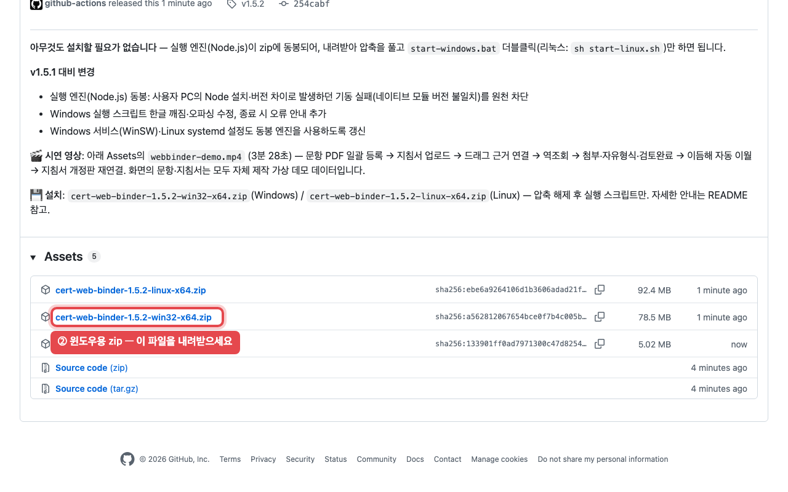

# 우수검사실 인증심사 웹 바인더 (Cert Web Binder)

인증·심사 문항의 **근거자료를 문항 단위로 묶어 관리**하는 사내(내부망) 웹 시스템입니다.
종이 바인더와 흩어진 파일을 대체하여, 심사위원이 문항 번호만으로 **3초 안에** 문항 본문·채점·
근거(지침서 PDF 인용, 자유형식 문서)를 찾아볼 수 있게 합니다.

> **English summary.** Cert Web Binder is an offline, single‑process web app that replaces the
> paper binders used to prepare for certification audits. Staff look up any checklist item by its
> number and instantly see the item text, its score, and its supporting evidence — verbatim quotes
> anchored into guideline PDFs plus free‑form rich documents. When next year's revised checklist
> arrives, answers and evidence links carry over automatically. It runs entirely on an internal
> network with no internet or CDN access: one Node process serves both the React SPA and the API,
> storing everything in a single SQLite database and a content‑addressed file store. Built with
> Express, better‑sqlite3 (WAL + FTS5), React/Vite, pdf.js, Tiptap, and ExcelJS. MIT‑licensed;
> all dependencies are permissive (MIT/Apache/BSD/OFL).

## 이 시스템이 하는 일

**1. 문항 자동 등록** — 인증기관이 배포한 심사점검표 PDF를 올리면 문항 번호·본문·배점·유형
(핵심/필요/기본)·목차(대분류→소분류)·개정 내역까지 자동으로 읽혀 등록됩니다. 실제 2026년
문항집 14부(1,662문항)로 검증했고, 사람이 따로 확인한 것은 1건이었습니다. 분야별로 담당자가
자기 분야 PDF만 따로 올려도 같은 연도로 합쳐집니다.

**2. 드래그로 근거 연결** — 문항 화면은 [문항 목차 | 문항·점수·근거 | 지침서 뷰어]의 3분할입니다.
지침서 본문을 마우스로 드래그하면 그 자리가 문항의 근거로 연결되고, 근거 칩 ①②③을 누르면
뷰어가 해당 위치로 이동해 하이라이트를 보여 줍니다. 문항 내용과 비슷한 지침서 페이지를 자동으로
찾아 주는 **근거 추천**도 있습니다(연결 확정은 항상 사람이 합니다). 지침서 발췌 외에
**자유형식 문서**(표·이미지 편집기), **파일 첨부·링크**도 같은 근거 카드에 붙일 수 있습니다.

**3. 채점** — 문항별로 단순(예/아니오, 문항에 따라 해당없음) · 합산(세부 항목별 점수의 합) ·
자동(기관 지표를 넣으면 구간표로 계산) 세 방식을 지원합니다. "예"를 고르면 만점이 자동 입력되되
사람이 확정하기 전까지 **미확정 표시**가 남습니다.

**4. 지침서 관리와 개정 자동 이관** — 검사·장비 지침서(기관마다 검사지침서·매뉴얼·SOP 등으로
부르는 문서)를 수백 부라도 일괄 업로드로 등록합니다(파일명이 곧 제목, 같은 제목은 새 판본).
지침서가 개정되어 새 판본을 올리면 **기존 근거 연결을 새 판본에서 자동으로 찾아 옮기고**,
문장이 바뀌어 확신할 수 없는 것만 '확인 필요' 목록에 남깁니다 — 시스템이 몰래 틀린 위치로
옮기는 일은 없습니다. 두 판본의 달라진 문장만 모아 보는 **판본 비교**도 있습니다.

**5. 해가 바뀌면 — 연차 이월** — 홈의 연도 목록(2026~2036)에서 새해를 골라 개정 문항집 PDF를
올리면, **작년 답변·근거 연결·첨부를 그대로 물려받고 점수만 새 심사에 맞춰 초기화**됩니다.
실행 전 미리보기가 몇 건이 이월되는지 보여 주고, 내용이 바뀐 문항은 '변경'·새 문항은 '신규'
표시가 붙으며, 문항 화면에서 전년도 문항과 나란히 비교할 수 있습니다. 지침서도 연도 탭으로
연도별로 관리됩니다.

**6. 찾기** — 통합 검색창(Ctrl+K) 하나로 문항 번호(부분 입력·구분자 생략 허용)·문항 내용·
**지침서 PDF 본문**까지 한 번에 찾습니다. 한국어 부분 일치라 단어 일부만 입력해도 됩니다.

**7. 점검** — **확인 필요** 메뉴에 사람이 다시 봐야 할 것(지침서 개정으로 끊긴 근거 연결,
재계산이 필요한 자동 채점, 개정된 문항의 채점 재확인)이 자동으로 모입니다. **준비도 진단**은
분야별 근거 없음·자동입력 미확정·재확인·지표 미입력 개수를 집계하고, 숫자를 클릭하면 해당
문항만 걸러 보여 줍니다.

**8. 산출물** — 감점·지적사항만 모은 결과 요약, 분야별/전체 엑셀 내보내기(준비도 요약 시트
포함), A4 종이 바인더 형식의 인쇄 화면.

**9. 함께, 안전하게** — 서버 한 대에 설치하면 같은 내부망의 여러 PC에서 브라우저로 동시에
접속해 함께 작업합니다(계정 역할: 관리자/편집/열람, 같은 문항 동시 수정은 충돌 감지).
모든 변경은 이력이 남고, 삭제는 복구 가능한 방식이며, 매일 자동 백업됩니다. 올린 문서는
내부망 서버 한 곳에만 저장되고 외부로 나가는 경로가 없습니다. 로그인 후 **사용 안내**
메뉴(`/guide`)에 화면별 설명이 내장되어 있습니다.

## 설치 — 내려받아 실행하기

**따로 설치할 프로그램이 없습니다.** 실행에 필요한 엔진(Node.js)까지 zip 안에 들어 있어서,
**zip 내려받기 → 압축 풀기 → 더블클릭** 세 동작이면 끝납니다.

1. 이 저장소의 **[Releases](https://github.com/niniattheriver/cert-web-binder/releases/latest)** 페이지에서
   Windows는 `…win32-x64.zip`, Linux는 `…linux-x64.zip` 파일을 내려받습니다.

   

2. zip 파일을 원하는 폴더에 **"모두 압축 풀기"로 압축 해제**하고, 폴더 안의 **`start-windows.bat` 를 더블클릭**합니다.
   몇 초 뒤 브라우저가 자동으로 열립니다. (Linux는 터미널에서 `sh start-linux.sh` 실행 후
   브라우저에서 `http://localhost:8080` 접속)

3. 로그인 화면이 뜨면 아이디는 **`admin`**, 비밀번호는 **맨 처음 실행 때 자동 생성된 초기
   비밀번호**입니다. 초기 비밀번호는 첫 실행 시 검은 실행 창에 1회 표시되고, 같은 내용이
   압축을 푼 폴더의 **`data\initial-admin-password.txt`** 파일에 저장됩니다 — 창에서 못
   봤다면 이 파일을 메모장으로 열어 확인하세요(로그인 화면에도 같은 안내가 표시됩니다).
   로그인한 뒤 비밀번호를 바꾸고 파일은 지워 주세요.

4. 동료들은 설치 없이 각자 PC의 브라우저에서 `http://서버PC주소:8080` 으로 접속하면 같은 화면을 함께 씁니다.
   - **서버PC주소**란 프로그램을 실행해 둔 PC의 내부망 IP 주소(점으로 구분된 숫자)입니다.
     예를 들어 서버 PC의 주소가 `192.168.0.23` 이라면, 동료는 자기 PC 브라우저 주소창에
     `http://192.168.0.23:8080` 을 입력하면 됩니다.
   - **주소 확인 방법** — 프로그램을 실행해 둔 PC에서: 시작 메뉴에 `cmd` 를 입력해
     **명령 프롬프트**를 열고, `ipconfig` 라고 입력한 뒤 Enter를 누릅니다. 결과 중
     **"IPv4 주소"** 줄에 나오는 숫자(예: `192.168.0.23`)가 서버PC주소입니다.
     (Linux 서버라면 터미널에서 `hostname -I` 로 확인합니다.)

> 잘 안 될 때: 브라우저가 안 열리면 주소창에 `http://localhost:8080` 을 직접 입력하세요.
> 실행 창(검은 창)을 닫으면 프로그램도 종료됩니다 — 부팅 시 자동 시작·백업 등 상시 운영 설정은
> [docs/INSTALL.md](docs/INSTALL.md)를 참고하세요.

### 개발·데모 실행 (소스에서, 5분)

선행조건: **Node LTS(20.19+ 또는 22.12+)** 하나. (릴리스 zip과 달리 소스 실행에는 Node 설치가
필요합니다 — [nodejs.org](https://nodejs.org/ko) 초록 버튼으로 설치. 화면 안내:
[docs/img/install-nodejs.png](docs/img/install-nodejs.png) ·
[docs/img/install-nodejs-msi.png](docs/img/install-nodejs-msi.png))

```bash
npm ci                 # 의존성 설치 (워크스페이스: server + web)
npm run seed:demo      # 데모 데이터 시드 → data/ (가상 기관·문항 55개·지침서 2부·매핑·채점)
npm run dev            # 서버(8080) + 웹(5173) 동시 기동
```

브라우저에서 **http://localhost:5173** → 로그인 **admin / day1pass**.

데모에는 실데이터가 전혀 없습니다 — 자체 제작한 가상 분야 2개(개인정보 보호 30문항 · 정보보안
25문항), 가상 지침서 2부가 들어 있습니다(`seed/demo-pdfs/README.md`).

> **저작권 안내** — 심사점검표(인증 문항)는 진단검사의학재단의 저작물(e-ISBN 등록
> 전자출판물)입니다. 재단의 저작권 안내에 따라 본 시스템은 **문항을 동봉·배포하지 않으며**,
> 각 기관이 재단으로부터 제공받은 점검표 PDF를 직접 등록해 사용하도록 설계했습니다.

**연차 이월 직접 재현** — `seed/demo-pdfs/2027/`에 가상 문항·지침서의 **2027년 개정판**이
동봉되어 있습니다. 가져오기 화면에서 연도를 2027로 고르고 `2027_50.pdf`·`2027_60.pdf`라는
이름으로 올리면(분야 코드는 파일명에서 읽으므로) 답변·근거가 이월되는 과정을, 지침서 화면에서
2027 개정판을 새 판본으로 올리면 근거 자동 이관과 '확인 필요' 분류를 직접 볼 수 있습니다.

검증:

```bash
npm test                       # 서버 단위 테스트 (vitest)
npm run typecheck              # server + web 타입체크
npm run build                  # web 프로덕션 빌드
npx playwright test            # E2E (데모 시드 + dev 서버 기동 상태에서)
```

## 아키텍처

```
브라우저(React SPA) ──┐
                      ├─ 단일 Node 프로세스 (프로덕션: 같은 포트로 SPA+API)
관리 API / 파일 ──────┘        │
                               ├─ SQLite (WAL) : app.db  ── FTS5 trigram, 불변 판본·근거 연결 모델
                               └─ 파일 저장소   : data/files/ (내용주소 sha256, 불변)
```

- **오프라인 전제** — 런타임에 인터넷·CDN 접근 없음. pdf.js의 cMaps·표준폰트는 앱 정적 경로에 동봉.
- **불변 모델** — 지침서는 판본(version) 단위로 보관하고, 문항↔근거 연결은 인용문 기반 위치
  기록으로 고정. 개정 시 정확 일치만 자동 이관, 나머지는 확인 필요 목록(조용한 오이관 없음).
- **하드삭제 없음** — 도메인 데이터는 soft delete(`deleted_at`) + 변경이력(change_log).
- 상세 설계는 [`설계서.md`](설계서.md)(사양 원천) 참조.

## 기술 스택

| 영역 | 사용 기술 |
|------|-----------|
| 런타임 | Node LTS(20/22) · TypeScript(tsx 실행) |
| 서버 | Express · better‑sqlite3(SQLite WAL + FTS5 trigram) · pdfjs‑dist(Node legacy) · ExcelJS · express‑session · bcryptjs · zod |
| 웹 | React 18 · Vite · react‑router · pdfjs‑dist + react‑pdf‑highlighter‑extended · Tiptap 3 · @tanstack/react‑virtual · diff(판본 비교) |
| 근사매칭 | approx‑string‑match (개정 자동 이관) |
| 인쇄 | 브라우저 `@media print` CSS |
| 테스트 | vitest(서버) · Playwright(E2E) |

의존성은 전부 permissive 라이선스입니다(MIT/Apache‑2.0/BSD‑3‑Clause, 폰트는 SIL OFL 1.1). 목록은 [NOTICE](NOTICE).

## 저장소 구조

```
server/   Express API · DB 마이그레이션 · PDF 문항 판독/추출 · 잡(백업·무결성) · 내보내기
web/      React SPA (pages/ · components/)
seed/     데모 시드 + 가상 지침서/문항 PDF(자체 생성·무저작권, 2026판+2027 개정판)
docs/     INSTALL.md(설치) · 운영런북.md(운영)
packaging/ 릴리스 스크립트 · systemd/WinSW · Dockerfile · 업그레이드 스크립트
설계서.md  사양 원천(단일 소스)
```

- `data/`(런타임 상태)와 `_로컬자료/`(실물 자료)는 **git에 포함하지 않습니다**(공개 저장소).

## 릴리스 (설치본)

`v*` 태그를 푸시하면 GitHub Actions가 테스트→빌드→패키징을 거쳐 **Linux/Windows 배포 zip**을
Releases에 자동 첨부합니다. zip은 완전 오프라인 실행 가능하며 **Node 실행 엔진까지 동봉**되어
대상 서버에 아무것도 설치할 필요가 없습니다. 데모 데이터가 필요하면 저장소를 클론해 위 "5분 설치"를 이용하세요.

## 문서

- 설치(내부망 오프라인): [docs/INSTALL.md](docs/INSTALL.md)
- 운영 런북(재시작·백업·사용자·무결성·운영 점검 화면 사용법·인증심사(실사) 전날 체크리스트): [docs/운영런북.md](docs/운영런북.md)
- 배포·서비스·릴리스: [packaging/README.md](packaging/README.md)
- 앱 내 사용 안내: 로그인 후 상단 **사용 안내** 메뉴(`/guide`)

## 개발 노트

개발 과정에서 AI 코딩 도구(Anthropic Claude)를 활용했습니다. 설계·요구 정의·검증과 최종
확인은 출품자가 수행했습니다.

## 라이선스

[MIT](LICENSE) © 2026 인증 근거자료 웹 바인더 기여자. 서드파티 고지는 [NOTICE](NOTICE) 참조.
